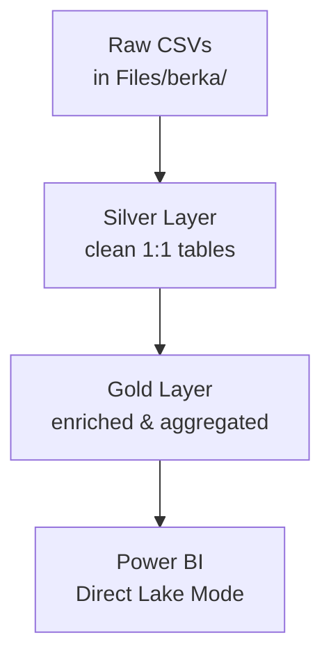

# End-to-End Fabrics Data Engineering Pipeline of Banking Loan Transactions
**100% Built in Microsoft Fabric • Delta Lake • Power BI Direct Lake**

[](https://fabric.microsoft.com/)
[](https://delta.io/)
[](https://powerbi.microsoft.com/)
[](https://opensource.org/licenses/MIT)

## Navigation
- [Overview](#overview)
- [Project Goal](#project-goal)
- [Dataset](#dataset)
- [Architecture (Medallion)](#architecture-medallion)
- [Gold Layer – Final Tables](#gold-layer--final-tables)
- [Schema Diagram](#schema-diagram)
- [How to Reproduce (10 Minutes)](#how-to-reproduce-10-minutes)
- [Power BI Dashboard](#power-bi-dashboard)
- [Instant Business Insights](#instant-business-insights)

## Overview
The **PKDD’99 Financial Dataset** (aka **Berka dataset**) is one of the most famous public banking datasets in the world. It contains real anonymized transactional data from a Czech bank (1993–1999). 
The data was ingested from Kaggle via think [this link](https://www.kaggle.com/datasets/marceloventura/the-berka-dataset). The dataset is originally from [here](https://webpages.charlotte.edu/mirsad/itcs6265/group1/index.html). More extensive information about the dataset there.

- 5,369 clients
- 1,056,320 transactions
- 892 credit cards (classic • junior • gold)
- 682 loans
- Full district demographics

This project transforms the 8 raw CSVs into a **production-grade analytics lakehouse** entirely inside **Microsoft Fabric** using the classic **Bronze → Silver → Gold** medallion architecture.

Result: **5 gold tables** that answer 99 % of related banking analytics questions in seconds.

## Project Goal
- Ingest & clean all 8 original CSV files
- Build a documented Silver layer
- Deliver a Gold layer optimized for credit-card analytics, client segmentation, and risk
- Enable instant Power BI dashboards via Direct Lake mode
- Fully document a reproducible approach to implementing the project

**Status: 100% complete • Production-ready**

## Architecture (Medallion)



## Dataset
[Ingestion Source of data is here](https://www.kaggle.com/datasets/marceloventura/the-berka-dataset)

The 8 original CSV files (can be accessed in this repository [here](https://github.com/EdidiongEsu/berka_fabrics/tree/main/data/Bronze%20layer)):

| File               | Rows       | Description                          |
|--------------------|------------|--------------------------------------|
| account.csv        | 4,500      | Bank accounts                        |
| client.csv         | 5,369      | Clients + district                   |
| disposition.csv    | 5,369      | Owner/disponent relationships        |
| card.csv           | 892        | Credit cards (classic/junior/gold)   |
| district.csv       | 77         | Demographics & unemployment          |
| loan.csv           | 682        | Loans + status (A/D = good/bad)      |
| order.csv          | 6,471      | Permanent orders                     |
| trans.csv          | 1,056,320  | All transactions                     |

## 🥇 Gold Layer – Final Tables
#### 📊 Gold Tables Overview

The data output of this project are the **5 production-ready gold tables** that power all downstream analytics. The table below is an overview of the 5 gold tables.

| Table | Rows | Description |
|-------|-------|-------------|
| **z_gold_dim_date** | **2,922** | Full calendar for 1993–2000 (`date_sk` as PK). |
| **z_gold_dim_client** | **5,369** | Enriched client dimension (age in 1999, demographics, card/loan flags). |
| **z_gold_fact_transaction** | **1,056,320** | Fully enriched transaction fact table with `client_id`, `card_type`, `is_card_transaction`, etc. |
| **z_gold_monthly_card_spending** | **~35,000** | Monthly credit-card KPIs by client + card type. |
| **z_gold_client_360** | **5,369** | One row per client with lifetime spend, latest card, defaulter flag, high-value flags, dormant cards, etc. |

#### Gold Tables Connection Diagram
The robustness of the gold tables meant joins of several cleaned silver tables. This diagram shows the connection between silver and gold tables.

Database diagram connection of silver and gold tables:


---

# 🗺 Schema Diagram

**Interactive Diagram:**  
https://dbdiagram.io/d/berka-gold

Or open:  
`docs/schema.dbml` in dbdiagram.io

---

# ⚙ How to Reproduce (10 Minutes)

100% inside Microsoft Fabric Lakehouse — no Databricks, no ADF.

## 1. Create a Fabric Lakehouse
- Create Lakehouse (e.g., `berka_lakehouse`)
- Upload the 8 CSV files into: `Files/berka/`

## 2. Create Silver Tables

```python
spark.sql("CREATE TABLE silver_dim_client       USING CSV OPTIONS (header=true, inferSchema=true) LOCATION 'Files/berka/client.csv'")
spark.sql("CREATE TABLE silver_dim_district     USING CSV OPTIONS (header=true, inferSchema=true) LOCATION 'Files/berka/district.csv'")
spark.sql("CREATE TABLE silver_dim_disposition  USING CSV OPTIONS (header=true, inferSchema=true) LOCATION 'Files/berka/disposition.csv'")
spark.sql("CREATE TABLE silver_dim_card         USING CSV OPTIONS (header=true, inferSchema=true) LOCATION 'Files/berka/card.csv'")
spark.sql("CREATE TABLE silver_fact_loan        USING CSV OPTIONS (header=true, inferSchema=true) LOCATION 'Files/berka/loan.csv'")
spark.sql("CREATE TABLE silver_fact_transaction USING CSV OPTIONS (header=true, inferSchema=true) LOCATION 'Files/berka/trans.csv'")
